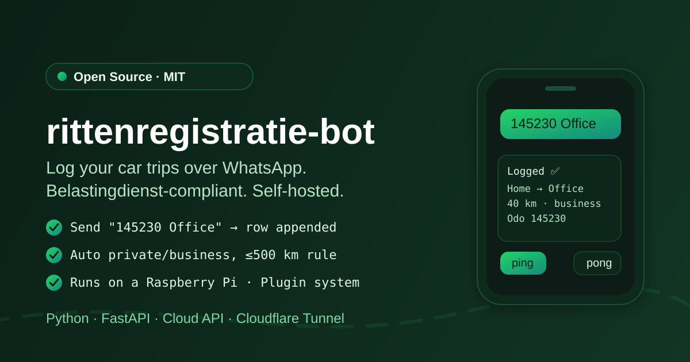
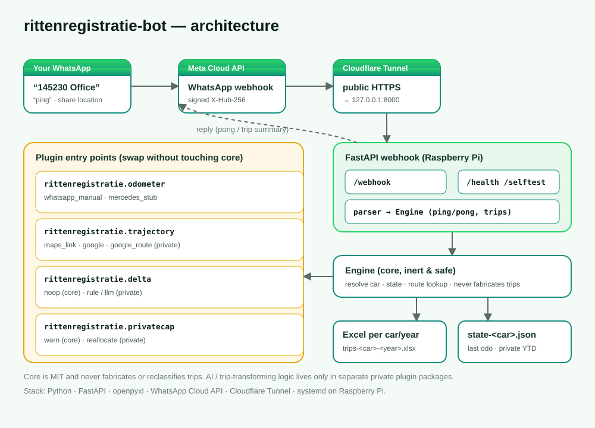

# rittenregistratie-bot

<p align="center">
  
</p>

<p align="center">
  <a href="https://github.com/eduelias/rittenregistratie-bot/actions/workflows/ci.yml"></a>
  <a href="LICENSE"></a>
  
  
</p>

A self-hosted WhatsApp bot that keeps a **Belastingdienst-compliant trip log
(rittenregistratie)** for one or more cars. You send a WhatsApp message with your
odometer reading and destination; it appends an audit-ready row to a per-year
Excel file and replies with a summary.

Designed to help holders of the Dutch
[*Verklaring geen privégebruik auto*](https://www.belastingdienst.nl/wps/wcm/connect/nl/personeel-en-loon/content/verklaring-geen-privegebruik-auto-aanvragen-wijzigen-intrekken)
keep the watertight trip administration the Belastingdienst requires, and to run
comfortably on a Raspberry Pi.

> **Disclaimer**
> This software helps you *record* trips. It is **not tax advice** and does not
> guarantee acceptance by the Belastingdienst. You are solely responsible for
> the correctness and completeness of your administration. The open-source core
> never fabricates, invents, or reclassifies trips.

## Features

- **Log by WhatsApp** — one message per trip: `145230 Office`.
- **Belastingdienst-compliant Excel** — date, begin/end odometer, begin/end
  address, route, private/business, per year and per car.
- **Multi-car** — sender phone number selects the car; separate logs per car.
- **Private/business** classification with the 500 km/year cap awareness.
- **Ask-for-address** — unknown destinations prompt for an address or a shared
  location (reverse-geocoded).
- **Plugin system** — swap odometer source, trajectory provider and private-cap
  reporting via entry points; the core stays a faithful recorder.
- **Self-hosted** — FastAPI + WhatsApp Cloud API, exposed via Cloudflare Tunnel,
  runs great on a Raspberry Pi.
- **`ping` → `pong`** connectivity check built in.

## How it works

Send a WhatsApp message:

```
145230 Office
145230 Office private
145230 Kantoor Amsterdam #private -- lunch with client
```

- First value = current odometer reading (end of trip).
- Rest = destination (a known name from `config/locations.yaml`, or free text).
- `private` / `#private` marks a private trip.
- Text after `--` or `|` is stored as a note.

Origin and start odometer are taken from the previous trip (seeded once via
config for the very first trip).

## Multi-car (identify car by phone number)

Each WhatsApp sender number is mapped to a car in `config/cars.yaml`. The
sender's number selects the car, so several people/cars can share one bot:

```yaml
default_car:
  label: "Company car"
  seed_address: "Home"
  seed_odometer: 145000
  phones: ["31612345678"]
van:
  label: "Delivery van"
  seed_address: "Depot"
  seed_odometer: 302000
  phones: ["31698765432", "31611112222"]
```

- Only numbers listed in `cars.yaml` are accepted; unknown numbers are ignored.
- Each car has its **own** state file (`state-<car>.json`) and Excel logs
  (`trips-<car>-<year>.xlsx`), keeping every administration separate.
- A phone number may belong to exactly one car.

## Onboarding new users

New people can join by simply **messaging the bot**. Their request is queued for
an **admin** (configured via `RIT_ADMIN_NUMBERS`) to approve — no config editing
needed.

1. A new number messages the bot → it replies that a request was sent, and
   notifies the admin(s).
2. An admin replies with WhatsApp commands:

   ```
   pending                                   # list join requests
   approve <number> <label> <seed_odo> [address]   # register a new user/car
   deny <number>                             # reject a request
   list                                      # list registered users
   remove <number|car_id>                    # remove a user
   help                                      # show admin commands
   ```

   e.g. `approve 31612345678 Alice Golf 45000 Delft`

3. The bot registers the number as a new car in `cars.yaml`, seeds its odometer,
   and **welcomes the new user**. They can start logging trips immediately.

Each user has their **own spreadsheet** (`trips-<car_id>-<year>.xlsx`) and state.
The number of users is capped by `RIT_MAX_USERS` (default 5). Removing a user
keeps their existing trip logs on disk.

Set `RIT_ONBOARDING_ENABLED=false` to silently ignore unregistered numbers.

## Excel schema (audit fields)

```
Date | Time | Type | StartAddress | EndAddress | StartOdo | EndOdo |
TripKm | Route | DeviationNote | Source | PrivateKmYTD
```

One file per car per year: `trips-<car>-<year>.xlsx`.

These map to the mandatory Belastingdienst fields: date, begin/end odometer,
begin/end address, the driven route (with a note when it deviates from the usual
route), and the business/private character. See `docs/belastingdienst.md`.

## Plugin system

Four extension points are discovered via setuptools entry points, so other
packages can add or override behaviour without changing the core:

| Group                        | Default (shipped)      | Purpose                              |
|------------------------------|------------------------|--------------------------------------|
| `rittenregistratie.odometer` | `whatsapp_manual`      | where odometer readings come from    |
| `rittenregistratie.trajectory`| `maps_link` / `google`| resolve the route between addresses  |
| `rittenregistratie.privatecap`| `warn`                | report on the 500 km/yr private cap  |

The core is a **faithful recorder**: it stores each trip exactly as reported
(the distance is always the real odometer difference) and never fabricates,
invents, or reclassifies trips. The shipped `warn` plugin only reports a message.

### Per-user private-cap plugin

By default one private-cap plugin applies to everyone. You can apply a
**different** cap plugin to specific numbers only:

```
RIT_PRIVATE_CAP_PLUGIN=warn                 # default for everyone
RIT_PRIVATE_CAP_PLUGIN_OVERRIDE=my_plugin   # a plugin you install...
RIT_PRIVATE_CAP_OVERRIDE_NUMBERS=31612345678,31698765432  # ...only for these
```

A car uses the override plugin if any of its numbers is on the list; all other
cars keep the default. Leave the override empty to disable this. You are
responsible for the behaviour of any plugin you install.

See `docs/plugins.md`.

## Architecture

<p align="center">
  
</p>

Your WhatsApp message → Meta Cloud API → Cloudflare Tunnel → the FastAPI webhook
on your Raspberry Pi. The parser turns it into a trip, the core Engine resolves
the car, updates state and appends a compliant Excel row, then replies. Plugin
entry points let you swap the odometer source, trajectory provider and
private-cap reporting without touching the core.

## Quick start

```bash
python3 -m venv .venv && . .venv/bin/activate
pip install -e ".[dev]"
cp config/.env.example .env    # then edit
pytest -q
uvicorn rittenregistratie.main:app --host 0.0.0.0 --port 8000
```

Then expose port 8000 to Meta with Cloudflare Tunnel (`deploy/cloudflared.md`)
and register the webhook. Run it as a service with `deploy/rittenregistratie.service`.

### Run as a systemd service

`deploy/rittenregistratie.service` runs uvicorn on `127.0.0.1:8000` as your
user. Adjust `User`, `Group` and the paths to match your host, then:

```bash
sudo cp deploy/rittenregistratie.service /etc/systemd/system/
sudo systemctl daemon-reload
sudo systemctl enable --now rittenregistratie.service
systemctl status rittenregistratie.service
curl -s http://127.0.0.1:8000/health   # {"status":"ok"}
```

## License

MIT — see [`LICENSE`](LICENSE).

## Contributing

Contributions are welcome! Please read [`CONTRIBUTING.md`](CONTRIBUTING.md) and
our [`CODE_OF_CONDUCT.md`](CODE_OF_CONDUCT.md). For security issues, see
[`SECURITY.md`](SECURITY.md).
